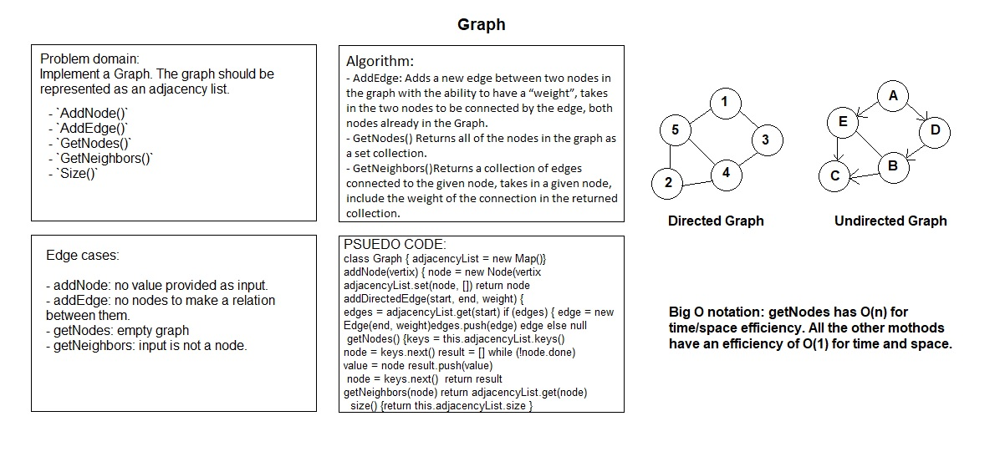

# Graph

# Challenge Summary

Implement a Graph. The graph should be represented as an adjacency list.

## Challenge Description

The graph should include the following methods:

- `AddNode()`
    - Adds a new node to the graph, takes in the value of that node, returns the added node.
- `AddEdge()`
    - Adds a new edge between two nodes in the graph, include the ability to have a “weight”, takes in the two nodes to be connected by the edge, both nodes should already be in the Graph.
- `GetNodes()`
    - Returns all of the nodes in the graph as a collection (set, list, or similar).
- `GetNeighbors()`
    - Returns a collection of edges connected to the given node, takes in a given node, include the weight of the connection in the returned collection.
- `Size()`
    - Returns the total number of nodes in the graph.

## Approach & Efficiency

I created Node and Edge classes. The Node takes a data property and the Edge takes node and weight properties. A Graph class uses a JavaScript Map as an adjacency list and employs that data structure's methods to implement the required functions.

## Whiteboard

