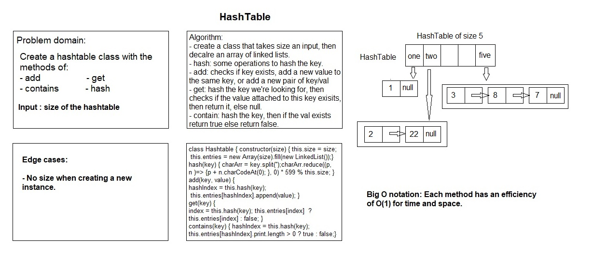

# HashTable

# Challenge Summary

A Hashtable is an array of a list. Each list is known as a bucket. 
In this challenge I used a linkedlist class for the bucket data type.

## Challenge Description

Hash table operations are performed in two steps:

- A key is converted into an integer index by using a hash function.
- This index decides the where the key-value pair record belongs.

## Approach & Efficiency

A hash table (hash map) is a data structure that implements an associative array abstract data type, a structure that can map keys to values. A hash table uses a hash function to compute an index, also called a hash code, into an array of buckets or slots, from which the desired value can be found. During lookup, the key is hashed and the resulting hash indicates where the corresponding value is stored.

## Whiteboard

