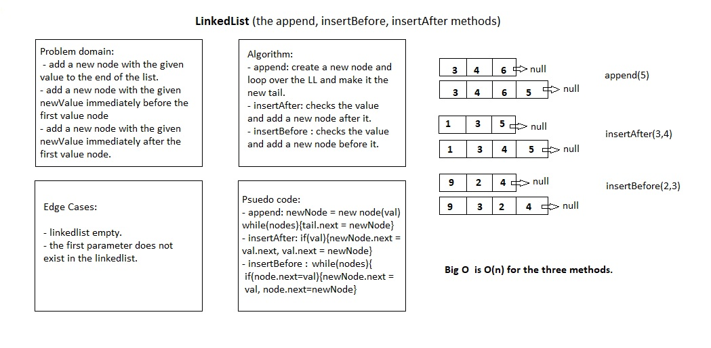

# LinkedList

# Challenge Summary

Creating a linkedlist data structure and it methods ( insert, includes, toString).

## Challenge Description

Create a LinkedList class with a method insert that can instantiate a new node with given data, a method includes that returns a Boolean for whether an argument value is stored in a node on the linked list, and a toString method that takes no arguments and returns a collection of all current node values on the linked list.

## Approach & Efficiency

- I created a class Node and a class LinkedList with the specified properties.
- insert(value) reassigns the head value of the LinkedList instance to that of a new instance of Node, avoiding iteration through the chain of nodes in the linked list. It has a space/time efficiency of O(1).
- includes(value) may iterate through the entire chain of nodes on the linked list to find a match to a given argument, but it only returns a Boolean. It has a time efficiency of O(n) and a space efficiency of O(1).
- toString() may iterate through the entire chain of nodes on the linked list to add the node's data to a returned collection. It has a time efficiency of O(n) and, because it creates a copy of all the data in the linked list, a space efficiency of O(n).
- append(value), which adds a new node with the given value to the end of the list.
- insertBefore(value, newVal), which add a new node with the given newValue immediately before the first value node
- insertAfter(value, newVal) which add a new node with the given newValue immediately after the first value node

## Solution
- for the insert, includes, toString methods

- for the append, insertBefore, insertAfter methods

- for the KthFromEnd method

