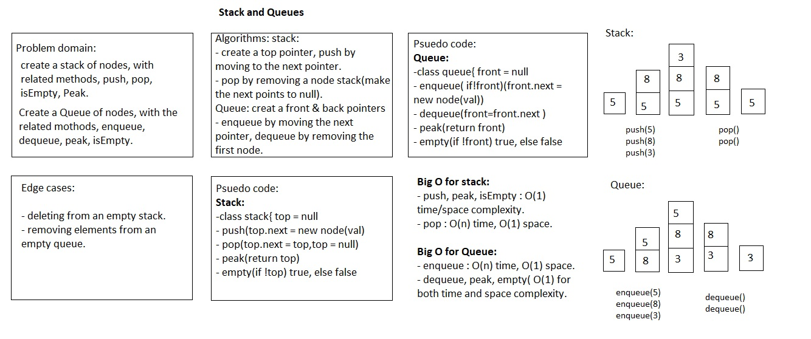

# Stacks and Queues

## Challenge

Implement a Stack and a Queue.

## Approach & Efficiency

### Node

The Node class is a duplicate of the Node class created for use with linked lists.

### Stack

- push instantiates a new instance of Node and reassigns top and next pointers in place for that node. This method has a time efficiency of O(1) and a space efficiency of O(1).
- pop checks whether top and top.next are defined and replaces the top with the next value, else null. It returns null if there is no top. This method has a time efficiency of O(1) and a space efficiency of O(1).
- peek returns the data of top if it exists, else null, without iteration. This method has a time efficiency of O(1) and a space efficiency of O(1).

### Queue

- enqueue instantiates a new instance of Node and reassigns appropriate back, next, and, if necessary, front pointers in place. This method has a time efficiency of O(1) and a space efficiency of O(1).
- dequeue iterates through the instance of Queue until it reaches the node before the front node. It returns the value of that front node's data and reassigns the new front to the node behind it, updating other pointers as necessary. Invoking dequeue on an empty queue returns null. This method has a time efficiency of O(n) and a space efficiency of O(1).
- peek returns the data of front if it exists, else null, without iteration. This method has a time efficiency of O(1) and a space efficiency of O(1).

## API

### Stack

- push(val) 
- pop() -> data
- peek() -> data

### Queue

- enqueue(val)
- dequeue() -> data
- peek() -> data

## Whiteboard

