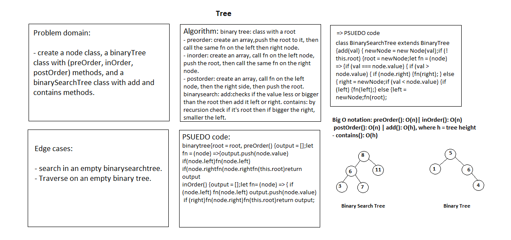
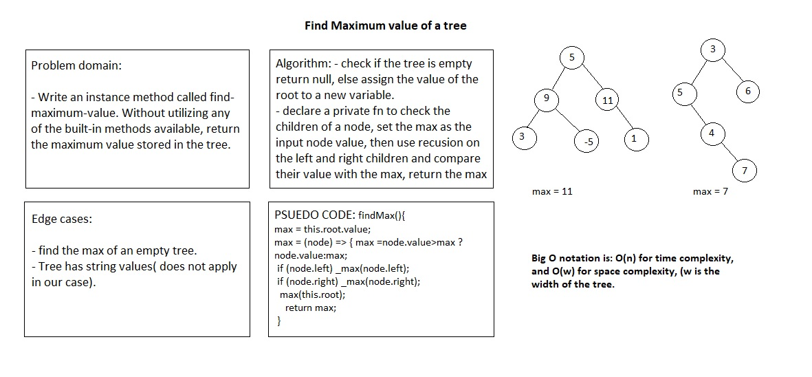

# Tree

## Challenge

Implement a Binary Tree and a Binary Search Tree.

## Approach & Efficiency

### Node

The Node class is a new class that has properties for the value stored in the node, the left child node, and the right child node.

### Binary Tree

A BinaryTree class that has a method for each of the depth first traversals called preOrder, inOrder, and postOrder which returns an array of the values, ordered appropriately.

### Binary Search Tree

A BinarySearchTree class, it has a method named add that accepts a value, and adds a new node with that value in the correct location in the binary search tree.
It also has a method named contains that accepts a value, and returns a boolean indicating whether or not the value is in the tree at least once.

## API

### Binary Tree

- preOrder(): traverses tree in the order of root, left, right
- inOrder(): traverses tree in the order of left, root, right
- postOrder(): traverses tree in the order of left, right, root

- findMaximumValue(): returns the maximum value in the whole tree.

### Binary Search Tree

- add(): adds a node to the BST containing a given value (further left for smaller and right for larger values)
- contains(): traverses tree to find a given value

## Efficiency

- preOrder(): O(n)
- inOrder(): O(n)
- postOrder(): O(n)
- add(): O(h), where h = tree height (worst case O(n))
- contains(): O(h), where h = tree height (worst case O(n))

- findMaximumValue(): O(n)

## Whiteboard

- findMaximumValue method

