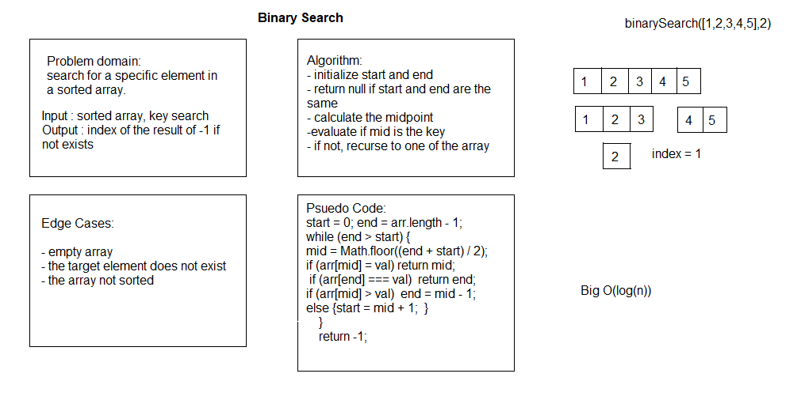

# Binary Search

# Challenge Summary

Binary search in a sorted 1D array

## Challenge Description

Write a function called BinarySearch which takes in 2 parameters: a sorted array and the search key. Without utilizing any of the built-in methods available to your language, return the index of the array’s element that is equal to the search key, or -1 if the element does not exist.

## Approach & Efficiency

create a start and end point, then divide the array into two and saving the index of the middle point then start checking if it equals the target key search and so on till it's found.

## Solution
