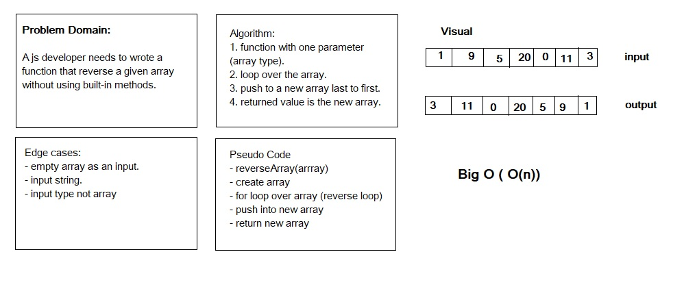

# Reverse an Array

Arrays and different ways of dealing with arrays data.

## Challenge

a function called reverseArray which takes an array as an argument and return an array with elements in reversed order.

## Approach & Efficiency

Done without utilizing any of the built-in methods available to the language.

## Solution
*check array-reverse folder*

