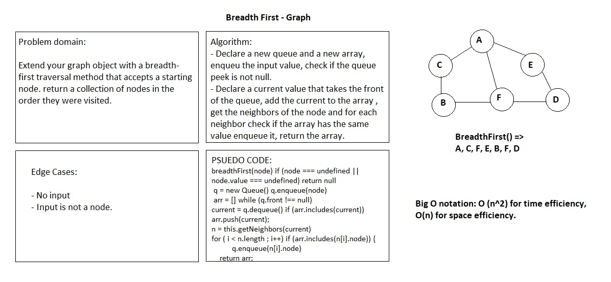

# Breadth-First Traversal of a Graph

# Challenge Summary

Extend your graph object with a breadth-first traversal method that accepts a starting node. 

## Challenge Description

Write a breadth-first traversal method that accepts a starting node. Without utilizing any of the built-in methods available to JavaScript, the method should return a collection of nodes in the order they were visited. Display the collection.

## Approach & Efficiency

I declared a new queue and a new array, then enqueued the input value, checked if the queue front value is not null then declare a current value that takes the front of the queue, then add the current to the array declared bfore, I got the neighbors of the node and for each neighbor I checked if the array has the same value then I enqueued it, then I returned the value of the array.

## Solution

