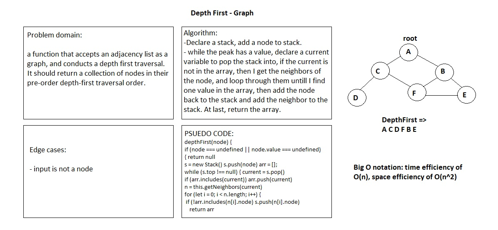

# Depth First Traversal

## Challenge

a function that accepts an adjacency list as a graph, and conducts a depth first traversal. Without utilizing any of the built-in methods available to JavaScript, return a collection of nodes in their pre-order depth-first traversal order.

## Approach & Efficiency

I declared a stack, added an argument node to stack, while the peak has a value, then I declared a current variable to pop the stack into, if the current is not in the array, I get the neighbors of the node, and loop through them until you find one value in the array, then add the node back to the stack and add the neighbor to the stack. At last, return the array.

## Solution

