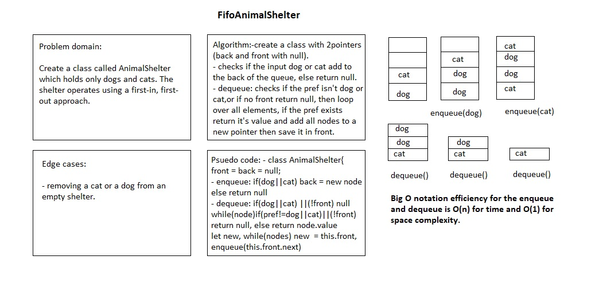

# Fifo Animal Shelter

# Challenge Summary

Create a class called AnimalShelter which holds only dogs and cats.

## Challenge Description

The shelter operates using a first-in, first-out approach.

The class has the following methods:

- `enqueue(animal)`: adds animal to the shelter. animal can be either a dog or a cat object.

- `dequeue(pref)`: returns either a dog or a cat. If pref is not "dog" or "cat" then return null.

## Approach & Efficiency

- create a queue-like class with front and back properties in its constructor.

- enqueue(animal): Adding an animal to the back of the animal shelter by instantiating a new instance of node with the animal value and reassigning pointers in place to place it at the back of the line in the animal shelter.

- dequeue(pref): We gave the first node in the queue an initial property and examined its value. If it did not match the pref, it was removed from the animal shelter and re-enqueued at the back of the line. When the first node's value matched pref, the node was removed from the queue, and the data was returned. When the target was found, it was stored in the variable target and removed from the animal shelter. 

## Solution

