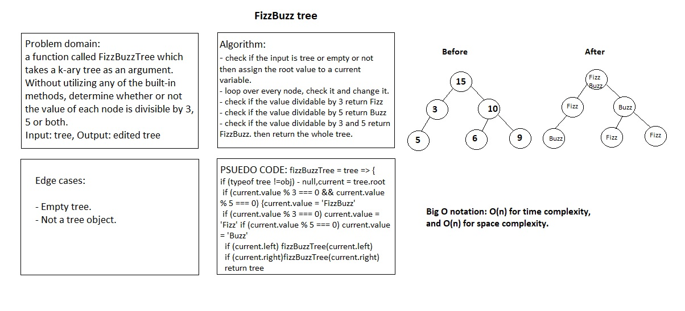

# Challenge Summary

a function called FizzBuzzTree which takes a k-ary tree as an argument.
Without utilizing any of the built-in methods available to your language, determine whether or not the value of each node is divisible by 3, 5 or both.

## Challenge Description

Create a new tree with the same structure as the original, but the values modified as follows:

- If the value is divisible by 3, replace the value with “Fizz”
- If the value is divisible by 5, replace the value with “Buzz”
- If the value is divisible by 3 and 5, replace the value with “FizzBuzz”
- If the value is not divisible by 3 or 5, simply turn the number into a String.

## Approach & Efficiency

following a preOrder traversal of the tree. On each node, the value of the node was examined to determine if it was divisible by 3, 5, or both. If it was, the value will be modified in-place with the appropriate word. If it was not, the traversal continued recursively on the left and right children of the node. 

## Solution

