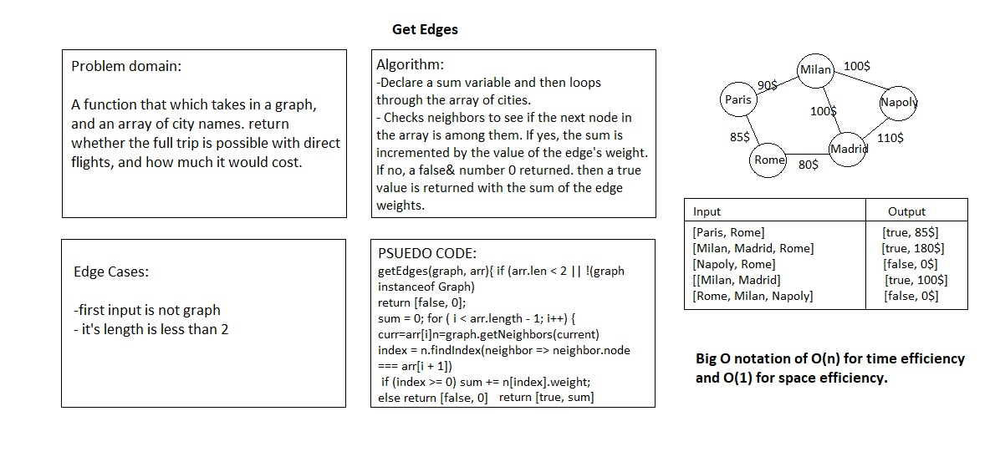

# Find Edges

## Challenge

A function that which takes in a graph, and an array of city names. Without utilizing any of the built-in methods available to JavaScript, and return whether the full trip is possible with direct flights, and how much it would cost.

## Approach & Efficiency

The algorithm has a sum variable and then loops through the array of vertices given, where each node or vertex represents a city. For each node in the array, it checks connected nodes or neighbors to see if the next node in the array is among them. If yes, the sum is incremented by the value of the edge's weight (the cost of a flight). If it's not, a falsy response is returned with the number 0. If the loop over the array argument completes, a true value is returned with the sum of the edge weights.

## Solution

