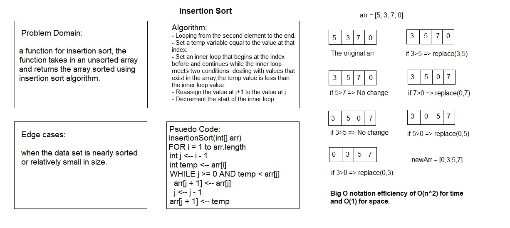

# Insertion Sort

# Challenge Summary

a function for insertion sort, the function takes in an unsorted array and returns the array sorted using insertion sort algorithm.

## Challenge Description

## Approach & Efficiency

This function loops through the array twice. The outer loop iterates from the second element. It assigns the inner loop's starting point to the beginning of the array and takes the value of the second element. The inner loop checks the value of the array at the outer loop index and moves it left in the array while it's less than the array value at the inner loop index.

This solution has a Big O notation efficiency of O(n^2) for time and O(1) for space.

## Solution

