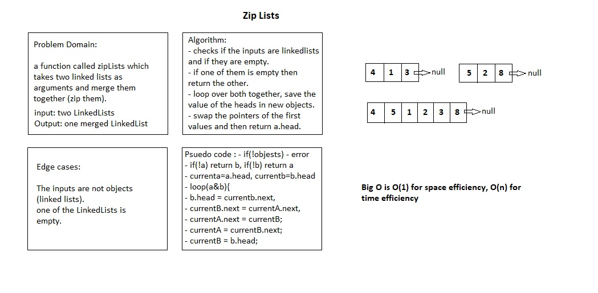

# Zip two linked lists

# Challenge Summary

a function called zipLists which takes two linked lists as arguments and merge them together (zip them).

## Challenge Description

Zip the two linked lists together into one so that the nodes alternate between the two lists and return a reference to the head of the zipped list. Try and keep additional space down to O(1). with the access to the Node class and all the properties on the Linked List class as well as the methods created in previous challenges.

## Approach & Efficiency

zipLists takes two linked lists a and b and declares two variables currentA and currentB pointing to each list's head. In the loop, it first advances each b.head to currentB.next and then begins reassigning a and b nodes' next pointers to point to a pair node on the other list, keeping nodes from a first in order. Once either currentA.next or currentB.next is null, the loop is complete, and any remaining nodes from b are added to the end of the result. a.head, the head of the resulting list, is returned.

## Solution

