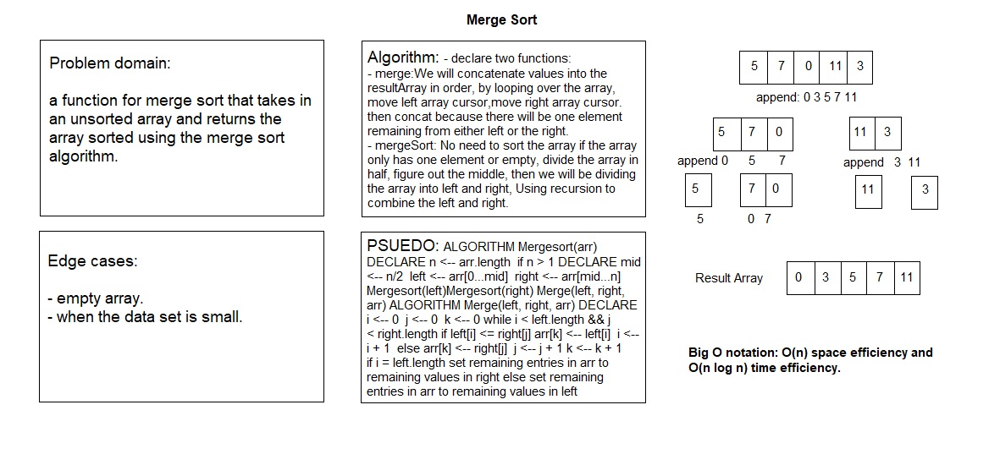

# Merge Sort

# Challenge Summary

a function for merge sort that takes in an unsorted array and returns the array sorted using the merge sort algorithm.

## Challenge Description

merge sort uses a divide-and-conquer, recursive methodology to sort an array. The algorithm does:
- Recursively split the input array in half until a sub-array with only one element is produced.
- Merge each sorted sub-array together to produce the final sorted array.

## Approach & Efficiency

The algorithm uses two helper functions. The first is a function to split arrays in two. This function returns an object with left and right properties with values of the left and right sides of the array. Then, it uses a merge function to compare the first elements of two arrays and put them into a new array in sorted order.

The mergeSort function has a base case of a an array with a length of 1 or less. In that function, an array is first split into left and right parts, and then mergeSort is called recursively on each half. At the top of the call stack, we get a left and right with one element each. Those values are assigned to l and r, and the two are merged together using merge. The merged array is returned. At the bottom of the call stack, that merged array will include all of the numbers in the original array.

## Solution

