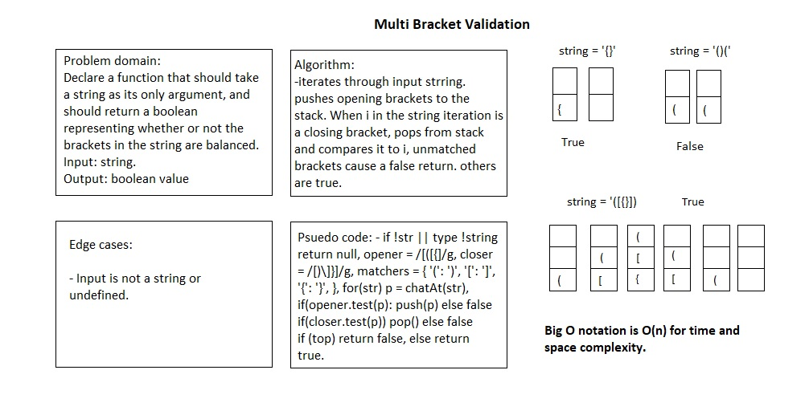

# Multi Bracket Validation

# Challenge Summary

Create a function called multiBracketValidation(input)

## Challenge Description

Declare a function that should take a string as its only argument, and should return a boolean representing whether or not the brackets in the string are balanced. There are 3 types of brackets:

- Round Brackets : `()`
- Square Brackets : `[]`
- Curly Brackets : `{}`

## Approach & Efficiency

create a stack as a helper data structure within this function because stacks use a LIFO model: when a closing bracket is encountered reading left to right, the first out of the stack of preceding opening brackets should always be its match.

examples and why they fail:

| Input | 	Output |	Why |
|-------|----------|--------|
| `{` |	FALSE |	error unmatched opening { remaining. |
| `)` |	FALSE |	error closing ) arrived without corresponding opening. |
| `[}` | FALSE |	error closing }. Doesn’t match opening (. |

## Solution

