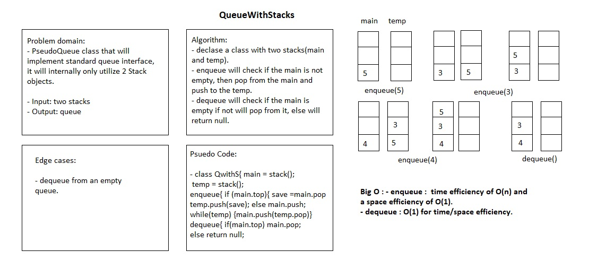

# Queue with stacks

# Challenge Summary

A brand new PseudoQueue class, this PseudoQueue class will implement our standard queue interface (the two methods listed below), but will internally only utilize 2 Stack objects. 

## Challenge Description

A PseudoQueue class will implement our standard queue interface (the two methods listed below), but will internally only utilize 2 Stack objects.

The class has the following methods:

- `enqueue(value)` which inserts value into the PseudoQueue, using a first-in, first-out approach.
- `dequeue()` which extracts a value from the PseudoQueue, using a first-in, first-out approach.

## Approach & Efficiency

- Each instance of PseudoQueue is instantiated with two instances of Stack in its constructor, main and temp. Both main and temp have push, pop, and peek methods.

- enqueue(val) adds a new node with the value val to the bottom of the main stack.

- dequeue returns the value from main's pop method if main.top is not null; otherwise, it returns null. 

## Solution

