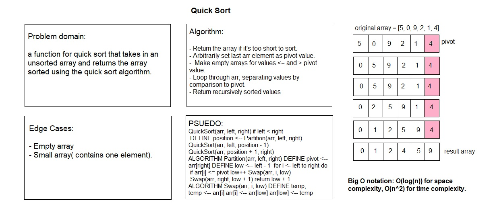

# Quick Sort

# Challenge Summary

a function for quick sort that takes in an unsorted array and returns the array sorted using the quick sort algorithm.

## Challenge Description

Quick sort is a highly efficient sorting algorithm and is based on partitioning of array of data into smaller arrays.

## Approach & Efficiency

Quick sort is a recursive divide-and-conquer approach to sorting an array. 
In this method, a pivot value is chosen in the original array. The array is then partitioned into two subarrays of values less than and greater than the pivot value. We then combine the result of recursively calling the quick sort algorithm on both sub-arrays. This continues until the base case of an empty or single-item array is reached, which we return. The unwinding of the recursive calls return us the sorted array.

## Solution

