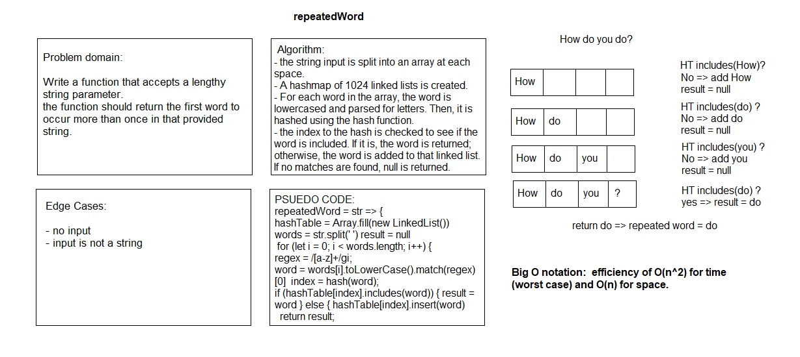

# Repeated Word

# Challenge Summary

Write a function that accepts a lengthy string parameter.

## Challenge Description

Without utilizing any of the built-in library methods available to javascript language, the function should return the first word to occur more than once in that provided string.

## Approach & Efficiency

I used a hash function and a repeatedWord function.The hash function converts a word to ASCII character codes, sums the codes, then multiplies them by 599, and returns the rounded-down remainder of that product divided by 1024.
In repeatedWord function, the string input is split into an array at each space. A hashmap of 1024 linked lists is created. For each word in the array, the word is lowercased and parsed for letters. Then, it is hashed using the hash function, and the linked list at the index corresponding to the hash is checked to see if the word is included. If it is, the word is returned; otherwise, the word is added to that linked list. If no matches are found, null is returned.

## Solution

