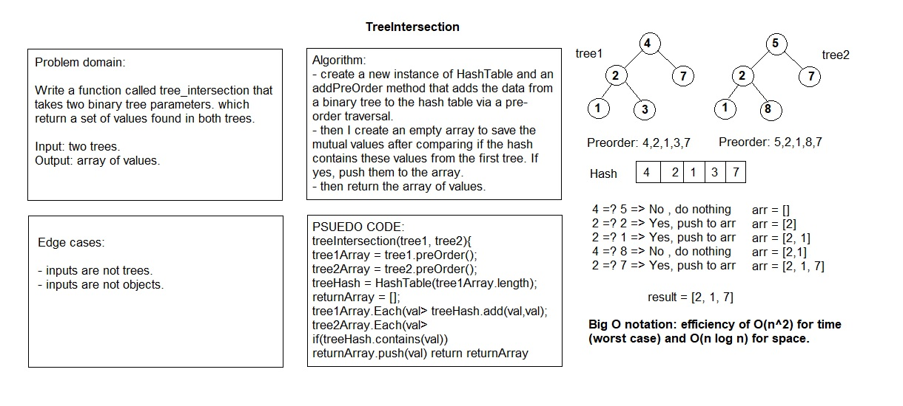

# Tree Tntersection

# Challenge Summary

Write a function called tree_intersection that takes two binary tree parameters.

## Challenge Description

Without utilizing any of the built-in library methods available to the javascript language, return a set of values found in both trees.

## Approach & Efficiency

I used the HashTable class with tests that has add(value), contains(value), hash(value) methods.
Within my treeIntersection function, I create a new instance of HashTable and an addPreOrder method that adds the data from a binary tree to the hash table with a pre-order traversal.
I then return from my hash table array of values that represents the intersection of the two tables.

## Solution

